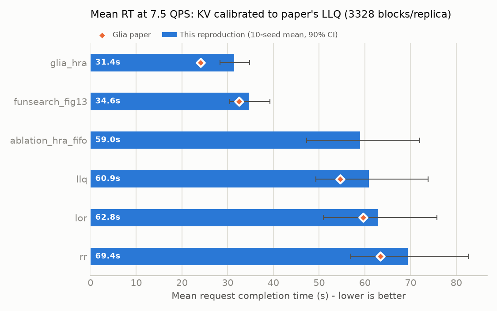
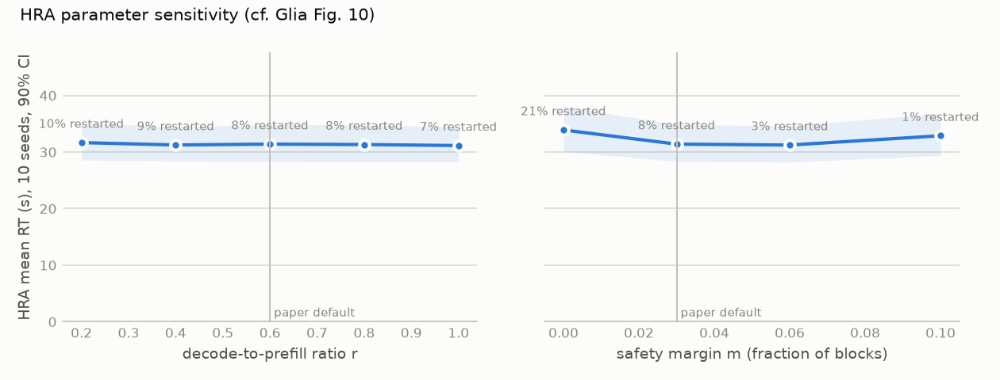

# Reproducing Glia's LLM request-routing results in Vidur

This repo reproduces the request-routing experiment from
**Glia: A Human-Inspired AI for Automated Systems Design and Optimization**
(Hamadanian et al., CAIS '26, [arXiv 2510.27176](https://arxiv.org/abs/2510.27176)).
The authors did not release code, but the paper gives the full simulation setup
and the full source of the routers it discusses, so both can be rebuilt on top of
[microsoft/vidur](https://github.com/microsoft/vidur).

## Results

All numbers: first-turn ShareGPT, 7.5 QPS, 4 x A10 / Llama-3-8B, 10 seeds (same 10 traces for every
router), mean request completion time (RT); 90% bootstrap CI over seeds. "vs LLQ" is the ratio of
10-seed means, the paper's convention (54.6 / 24.1 = 2.27x).

### Headline: KV capacity calibrated to the paper's LLQ baseline (3328 blocks/replica)



| Router | Mean RT (s) | 90% CI | Restarted | Paper RT (s) | vs LLQ (ours) | vs LLQ (paper) |
|---|---|---|---|---|---|---|
| Round-robin | 69.4 | [56.9, 82.6] | 16% | 63.4 | 0.88x | 0.86x |
| LOR | 62.8 | [51.0, 75.8] | 19% | 59.6 | 0.97x | 0.92x |
| LLQ | 60.9 | [49.3, 73.9] | 18% | 54.6 | 1.00x | 1.00x |
| HRA with FIFO queue (ablation) | 59.0 | [47.2, 72.0] | 4% | - | 1.03x | - |
| FunSearch router (Fig. 13) | 34.6 | [30.5, 39.2] | 2% | 32.5 | 1.76x | 1.68x |
| **Glia HRA (Fig. 12)** | **31.4** | [28.3, 34.8] | 8% | **24.1** | **1.94x** | **2.27x** |

Paired per seed, HRA is faster than LLQ on 10/10 seeds (geo-mean RT ratio 0.547, CI [0.49, 0.62])
and faster than the FunSearch router on 9/10 seeds (FunSearch/HRA = 1.09, CI [1.07, 1.12]).
Full tables: `results/first_turn_kv3328/summary.md`.

**What reproduces**
- The ranking RR > LOR > LLQ > FunSearch > HRA, and the baselines' spacing (RR/LLQ 1.14 vs 1.16 in the paper).
- HRA is ~2x better than LLQ (1.94x vs the paper's 2.2x) and wins on every seed.
- The FunSearch router is ~1.7x better than LLQ, as in the paper.
- Fig. 10's robustness claim: HRA's mean RT moves < 1 s for r in [0.2, 1.0]; the paper's
  defaults (r = 0.6, m = 3%) sit at the flat optimum, so re-tuning does not help:

  

**What does not (fully) reproduce**
- HRA's absolute RT: 31.4 s vs 24.1 s. HRA still restarts 8% of requests here.
- The HRA-vs-FunSearch gap is 1.09x, vs 1.35x in the paper.
- The paper's narrative (Sec. 3.3) credits admission control alone with ~25% before SPF was added.
  With the paper's final constants and a FIFO queue we see only ~3%. Almost all of HRA's gain comes
  from shortest-prompt-first *ordering of the held queue*, which admission control makes possible.
- The expert router is not published, so it is not reproduced.

### The KV-cache budget is the knob that matters

HRA exists to avoid vLLM restarts, so its advantage depends on memory pressure. The paper does not
state the KV capacity, so we measured all routers at several budgets:

| KV blocks / replica | LLQ RT (s) | LLQ restarted | HRA RT (s) | HRA vs LLQ | FunSearch vs LLQ | Note |
|---|---|---|---|---|---|---|
| 2048 | 220.8 | 31% | 95.2 | 2.32x | 2.01x | ~real vLLM on a 24 GB A10; saturated |
| 2560 | 132.2 | 26% | - | - | - | LLQ only |
| 3072 | 78.8 | 21% | - | - | - | LLQ only |
| **3328** | **60.9** | 18% | **31.4** | **1.94x** | **1.76x** | **closest to paper's LLQ (54.6 s)** |
| 3584 | 47.9 | 15% | 28.4 | 1.69x | 1.58x | |
| 4096 | 32.6 | 7% | 26.1 | 1.25x | 1.22x | Vidur's memory planner default |

HRA is best and FunSearch second at every budget. How much they win by grows with memory
pressure. The multi-turn reading of ShareGPT saturates the cluster at 7.5 QPS (every baseline
~355 s, `results/multi_turn_kv4096`), so it is not the paper's operating point ("7.5 QPS sits at the knee").

### A hint for beating HRA

In first-turn ShareGPT, output length is essentially independent of prompt length
(corr(log prompt, log decode) = 0.06; mean decode is 256-314 tokens in every prompt-size bucket, and
the median prompt is 33 tokens). HRA reserves `prompt x r` for decode growth, so short prompts reserve
almost nothing. That is why HRA still has 8% restarts at 3328 blocks. vLLM evicts the *youngest*
request, so the restarts land on arbitrary requests, not only the long 10x-decode ones.


## What was rebuilt, and how faithfully

| Paper (Sec. 5, Figs. 12-15) | This repo | Confidence |
|---|---|---|
| Vidur simulator | `microsoft/vidur` @ `abae7f6` + `patches/vidur-glia.patch` | exact code base |
| Router called on every arrival **and every completion** (Fig. 14/15 prompt) | patch: `BatchEndEvent` emits a `GlobalScheduleEvent` when a request finishes | exact semantics |
| Replicas expose `pending_queue`, `active_queue`, `num_active_requests`, `block_size`, `num_blocks` (used by Figs. 12/13) | patch: `BaseReplicaScheduler` | exact semantics |
| LLQ baseline = fewest in-flight (pending+active); LOR = fewest waiting | `llq` (new), `lor` (Vidur's) | exact |
| vLLM-style memory: incremental KV blocks, evict youngest on OOM, restart from scratch | Vidur's Sarathi scheduler (unchanged) | exact |
| Sarathi chunked prefill, chunk 8192 | `SarathiSchedulerConfig(chunk_size=8192)` | exact |
| 4 x NVIDIA A10, Llama-3-8B-Instruct | **A10 profile is synthesized** (see below); Vidur's `Meta-Llama-3-8B` architecture | approximate |
| ShareGPT (`anon8231489123/ShareGPT_Vicuna_unfiltered`) | same file (V3 cleaned split), Llama-3 tokenizer, first user turn -> first reply | exact data; request construction is a choice (see below) |
| 5% prompts and 5% decodes inflated 10x, independently | `scripts/gen_workload.py` | exact |
| 7.5 QPS, log-normal inter-arrivals, sigma = 2 | `scripts/gen_workload.py` (mean gap = 1/7.5 s) | exact |
| 1000 s benchmark, 10 seeds, 90% bootstrap CI | seeds 0-9, arrivals over 1000 s, run to completion | exact |
| HRA router (Fig. 12) | `routers/glia_hra.py` - verbatim | exact |
| FunSearch router (Fig. 13) | `routers/funsearch_fig13.py` - verbatim (+imports) | exact |
| Expert router | not published | - |

### Unavoidable approximations

1. **A10 compute profile.** Vidur ships no A10 profile, and Llama-3-8B is only profiled on A100.
   `scripts/make_a10_profile.py` transfers the A100 Llama-3-8B profile per operator using the
   *measured* A40/A100 ratio from Vidur's Llama-2-7B profiles (looked up by operator work, so
   memory-bound ops get ~2.9x and compute-bound ops ~2.0x), then a 1.2x A40 -> A10 hardware factor
   (600 vs 696 GB/s, 125 vs 150 TFLOPS). Sanity check: batch-1 decode ~31 ms/token and
   8K-token prefill ~1.5 s, consistent with an A10 running Llama-3-8B in fp16.
2. **KV-cache size.** Not stated in the paper, and the results depend strongly on it (see above).
   Vidur's memory planner gives 4096 blocks (65K tokens) for a 24 GB A10, because its parameter counter
   omits the 128K-vocab embedding and LM head. That is about 2x what vLLM leaves on a real A10 (~2048 blocks).
   The headline uses 3328 blocks: calibrated so LLQ lands near the paper's LLQ (1 parameter fit on 1
   baseline). It is also what Vidur's planner produces for a 22 GB device with `max_tokens=4096`. Every
   other router is evaluated out-of-sample at that setting. `--num_blocks` changes it.
3. **ShareGPT -> requests.** The paper does not say how conversations became requests. Two
   readings are provided: `first_turn` (vLLM benchmark convention: first user message -> first
   reply) and `multi_turn` (every reply is a request whose prompt is the whole history; Sarathi /
   Vidur convention). Hugging Face is not reachable from the build environment; the identical file
   (sha256 `35f0e213...79ba4`) was fetched from a public Git LFS mirror.

## Layout

```
patches/vidur-glia.patch     all simulator changes (LLQ, custom-router loader, completion trigger,
                             pending/active queues, A10 SKU, request telemetry)
scripts/setup.sh             clone Vidur @ pinned commit, apply patch, build A10 profile, warm cache
scripts/make_a10_profile.py  A10 profile synthesis
scripts/tokenize_sharegpt.py ShareGPT -> per-turn Llama-3 token counts
scripts/make_length_tables.py / gen_workload.py   request lengths -> 10-seed traces
data/lengths/                (prompt, decode) length tables derived from ShareGPT
data/traces/<workload>/      the exact traces used (seeds 0-9)
routers/                     glia_hra.py, funsearch_fig13.py, ablation_hra_fifo.py, template_router.py
glia_repro/run.py            run routers x seeds in parallel; prints per-router summary
glia_repro/report.py         aggregate -> results/<tag>/summary.{csv,md}, mean_rt.png
results/                     summaries + per-request CSVs for every run reported here
```

## Testing your own router

```bash
./scripts/setup.sh                                   # once (~30 min: trains Vidur's runtime predictors)
cp routers/template_router.py routers/my_router.py   # implement schedule()
python -m glia_repro.run --routers routers/my_router.py llq routers/glia_hra.py   # 10 seeds, 3328 blocks
python -m glia_repro.report --tag first_turn_kv3328                                # table, paired stats, chart
# robustness: repeat with --num_blocks 2048 / 4096 (tags first_turn_kv2048 / first_turn_kv4096)
```

One simulation takes ~30 s, so a 10-seed comparison takes ~2 min on 4 cores. Results for LLQ, HRA, etc.
are already in `results/`, so they are not re-run; runs are skipped when their `summary.json` exists
(`--force` re-runs them). The report prints a **paired per-seed comparison** against LLQ and HRA. Every
router sees the same 10 traces, so this is much more sensitive than comparing overlapping CIs.
`template_router.py` documents exactly what state a router may read. As in the paper, a router
may **not** use `request.num_decode_tokens` (the oracle output length).
